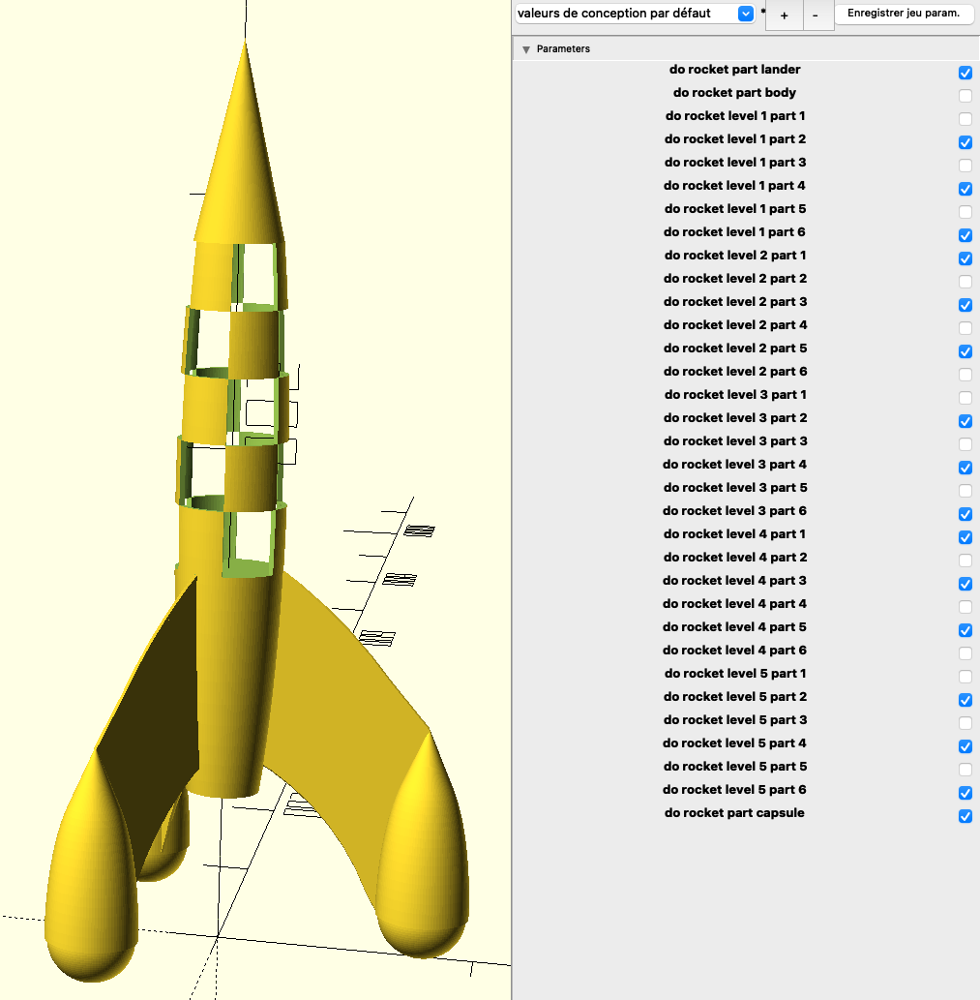

# Description




# Build

```bash
$ make clean
```

```bash
$ make prepare
ln -s tintin-rocket.scad rocket-level-1-part-1.scad
ln -s tintin-rocket.scad rocket-level-1-part-2.scad
ln -s tintin-rocket.scad rocket-level-1-part-3.scad
ln -s tintin-rocket.scad rocket-level-1-part-4.scad
ln -s tintin-rocket.scad rocket-level-1-part-5.scad
ln -s tintin-rocket.scad rocket-level-1-part-6.scad
ln -s tintin-rocket.scad rocket-level-2-part-1.scad
ln -s tintin-rocket.scad rocket-level-2-part-2.scad
ln -s tintin-rocket.scad rocket-level-2-part-3.scad
ln -s tintin-rocket.scad rocket-level-2-part-4.scad
ln -s tintin-rocket.scad rocket-level-2-part-5.scad
ln -s tintin-rocket.scad rocket-level-2-part-6.scad
ln -s tintin-rocket.scad rocket-level-3-part-1.scad
ln -s tintin-rocket.scad rocket-level-3-part-2.scad
ln -s tintin-rocket.scad rocket-level-3-part-3.scad
ln -s tintin-rocket.scad rocket-level-3-part-4.scad
ln -s tintin-rocket.scad rocket-level-3-part-5.scad
ln -s tintin-rocket.scad rocket-level-3-part-6.scad
ln -s tintin-rocket.scad rocket-level-4-part-1.scad
ln -s tintin-rocket.scad rocket-level-4-part-2.scad
ln -s tintin-rocket.scad rocket-level-4-part-3.scad
ln -s tintin-rocket.scad rocket-level-4-part-4.scad
ln -s tintin-rocket.scad rocket-level-4-part-5.scad
ln -s tintin-rocket.scad rocket-level-4-part-6.scad
ln -s tintin-rocket.scad rocket-level-5-part-1.scad
ln -s tintin-rocket.scad rocket-level-5-part-2.scad
ln -s tintin-rocket.scad rocket-level-5-part-3.scad
ln -s tintin-rocket.scad rocket-level-5-part-4.scad
ln -s tintin-rocket.scad rocket-level-5-part-5.scad
ln -s tintin-rocket.scad rocket-level-5-part-6.scad
ln -s tintin-rocket.scad rocket-part-body.scad
ln -s tintin-rocket.scad rocket-part-capsule.scad
ln -s tintin-rocket.scad rocket-part-lander.scad
```

```bash
$ make build
openscad -q -o "rocket-part-body.stl" -p parameters.json -P rocket-part-body  "rocket-part-body.scad"
openscad -q -o "rocket-part-capsule.stl" -p parameters.json -P rocket-part-capsule  "rocket-part-capsule.scad"
openscad -q -o "rocket-part-lander.stl" -p parameters.json -P rocket-part-lander  "rocket-part-lander.scad"
openscad -q -o "rocket-level-1-part-1.stl" -p parameters.json -P rocket-level-1-part-1  "rocket-level-1-part-1.scad"
openscad -q -o "rocket-level-1-part-2.stl" -p parameters.json -P rocket-level-1-part-2  "rocket-level-1-part-2.scad"
openscad -q -o "rocket-level-1-part-3.stl" -p parameters.json -P rocket-level-1-part-3  "rocket-level-1-part-3.scad"
openscad -q -o "rocket-level-1-part-4.stl" -p parameters.json -P rocket-level-1-part-4  "rocket-level-1-part-4.scad"
openscad -q -o "rocket-level-1-part-5.stl" -p parameters.json -P rocket-level-1-part-5  "rocket-level-1-part-5.scad"
openscad -q -o "rocket-level-1-part-6.stl" -p parameters.json -P rocket-level-1-part-6  "rocket-level-1-part-6.scad"
openscad -q -o "rocket-level-2-part-1.stl" -p parameters.json -P rocket-level-2-part-1  "rocket-level-2-part-1.scad"
openscad -q -o "rocket-level-2-part-2.stl" -p parameters.json -P rocket-level-2-part-2  "rocket-level-2-part-2.scad"
openscad -q -o "rocket-level-2-part-3.stl" -p parameters.json -P rocket-level-2-part-3  "rocket-level-2-part-3.scad"
openscad -q -o "rocket-level-2-part-4.stl" -p parameters.json -P rocket-level-2-part-4  "rocket-level-2-part-4.scad"
openscad -q -o "rocket-level-2-part-5.stl" -p parameters.json -P rocket-level-2-part-5  "rocket-level-2-part-5.scad"
openscad -q -o "rocket-level-2-part-6.stl" -p parameters.json -P rocket-level-2-part-6  "rocket-level-2-part-6.scad"
openscad -q -o "rocket-level-3-part-1.stl" -p parameters.json -P rocket-level-3-part-1  "rocket-level-3-part-1.scad"
openscad -q -o "rocket-level-3-part-2.stl" -p parameters.json -P rocket-level-3-part-2  "rocket-level-3-part-2.scad"
openscad -q -o "rocket-level-3-part-3.stl" -p parameters.json -P rocket-level-3-part-3  "rocket-level-3-part-3.scad"
openscad -q -o "rocket-level-3-part-4.stl" -p parameters.json -P rocket-level-3-part-4  "rocket-level-3-part-4.scad"
openscad -q -o "rocket-level-3-part-5.stl" -p parameters.json -P rocket-level-3-part-5  "rocket-level-3-part-5.scad"
openscad -q -o "rocket-level-3-part-6.stl" -p parameters.json -P rocket-level-3-part-6  "rocket-level-3-part-6.scad"
openscad -q -o "rocket-level-4-part-1.stl" -p parameters.json -P rocket-level-4-part-1  "rocket-level-4-part-1.scad"
openscad -q -o "rocket-level-4-part-2.stl" -p parameters.json -P rocket-level-4-part-2  "rocket-level-4-part-2.scad"
openscad -q -o "rocket-level-4-part-3.stl" -p parameters.json -P rocket-level-4-part-3  "rocket-level-4-part-3.scad"
openscad -q -o "rocket-level-4-part-4.stl" -p parameters.json -P rocket-level-4-part-4  "rocket-level-4-part-4.scad"
openscad -q -o "rocket-level-4-part-5.stl" -p parameters.json -P rocket-level-4-part-5  "rocket-level-4-part-5.scad"
openscad -q -o "rocket-level-4-part-6.stl" -p parameters.json -P rocket-level-4-part-6  "rocket-level-4-part-6.scad"
openscad -q -o "rocket-level-5-part-1.stl" -p parameters.json -P rocket-level-5-part-1  "rocket-level-5-part-1.scad"
openscad -q -o "rocket-level-5-part-2.stl" -p parameters.json -P rocket-level-5-part-2  "rocket-level-5-part-2.scad"
openscad -q -o "rocket-level-5-part-3.stl" -p parameters.json -P rocket-level-5-part-3  "rocket-level-5-part-3.scad"
openscad -q -o "rocket-level-5-part-4.stl" -p parameters.json -P rocket-level-5-part-4  "rocket-level-5-part-4.scad"
openscad -q -o "rocket-level-5-part-5.stl" -p parameters.json -P rocket-level-5-part-5  "rocket-level-5-part-5.scad"
openscad -q -o "rocket-level-5-part-6.stl" -p parameters.json -P rocket-level-5-part-6  "rocket-level-5-part-6.scad"
```

```bash
$ make end
rm -f rocket-part-body.scad rocket-part-capsule.scad rocket-part-lander.scad rocket-level-1-part-1.scad rocket-level-1-part-2.scad rocket-level-1-part-3.scad rocket-level-1-part-4.scad rocket-level-1-part-5.scad rocket-level-1-part-6.scad rocket-level-2-part-1.scad rocket-level-2-part-2.scad rocket-level-2-part-3.scad rocket-level-2-part-4.scad rocket-level-2-part-5.scad rocket-level-2-part-6.scad rocket-level-3-part-1.scad rocket-level-3-part-2.scad rocket-level-3-part-3.scad rocket-level-3-part-4.scad rocket-level-3-part-5.scad rocket-level-3-part-6.scad rocket-level-4-part-1.scad rocket-level-4-part-2.scad rocket-level-4-part-3.scad rocket-level-4-part-4.scad rocket-level-4-part-5.scad rocket-level-4-part-6.scad rocket-level-5-part-1.scad rocket-level-5-part-2.scad rocket-level-5-part-3.scad rocket-level-5-part-4.scad rocket-level-5-part-5.scad rocket-level-5-part-6.scad
```

# Print

